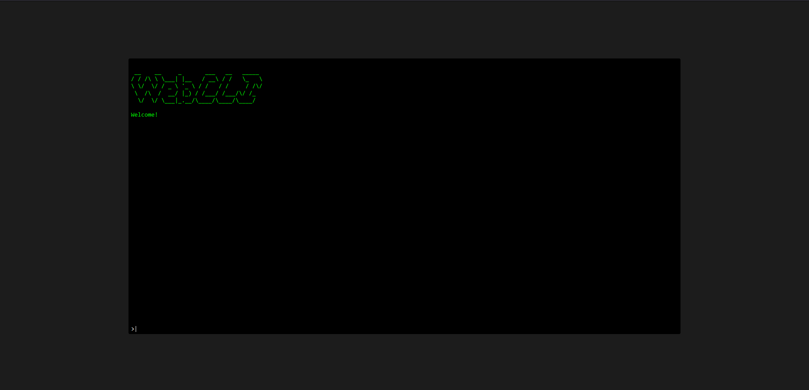

# Web Cli

A CLI for the webbrowser.\
You can add Commands which you can execute.\
You can use text outputs and the js browser APIs.

There are a bunch of commands implemented to show the capabilities. (look at the Functionality section)

## built with

- React

## Functionality

### CLI

### help

The help command reads all registred commands and displays the name, description and usage privided by each registred command.

### echo

The echo command echoes the arguments to the console.

### alert

The alert command alerts the arguments (browser api).

### joke

The joke command fetches (async) a random joke from https://icanhazdadjoke.com/ and displays it in the console

### open

The open command opens a url in a new tab or new window.

### time

The time command displays the current time.

## Register commands

1. create a command class extending AbstractCommand
   - It needs the strings name, description and usage, optionaly the showCommand attribute.

2. Register the command in the commandHandler.ts

## Video

TODO:
