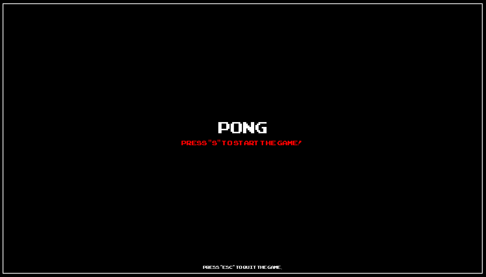
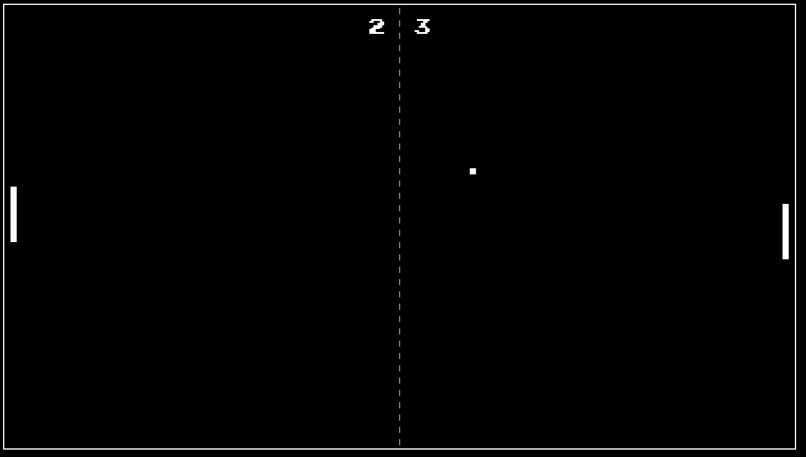
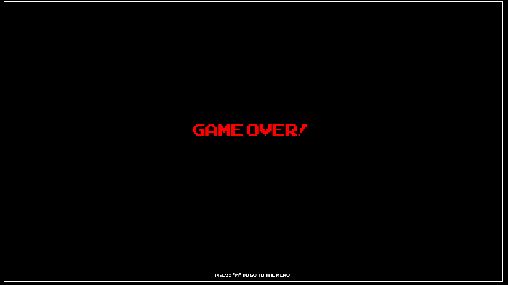

# PONG

A basic Pong game with a little ts engine

## built with

- typescript

## Functionality

### startscreen

### ingame

You can control the left pedal with w for up and s for down and the right pedal with up arrow and down arrow.

### gameover

Gameover when score of one party is more then 10

## Video

https://www.youtube.com/watch?v=todo

