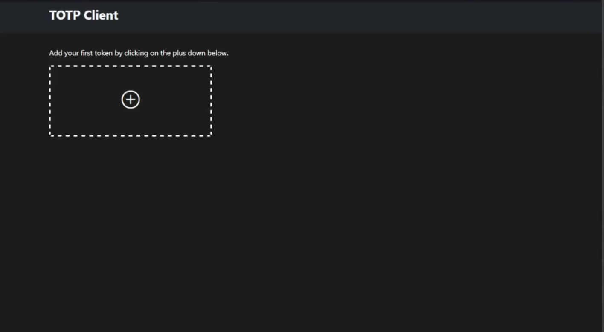
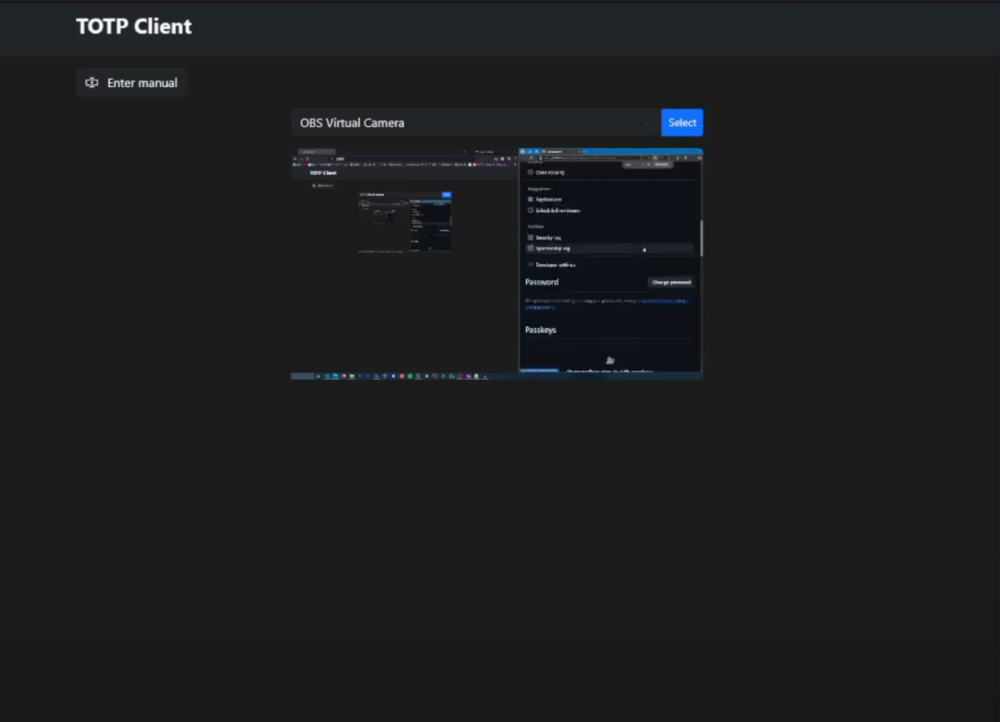
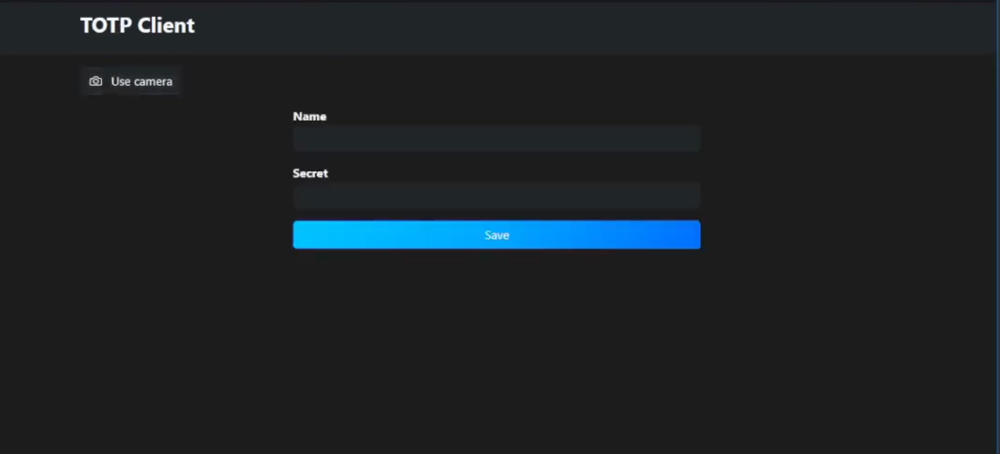
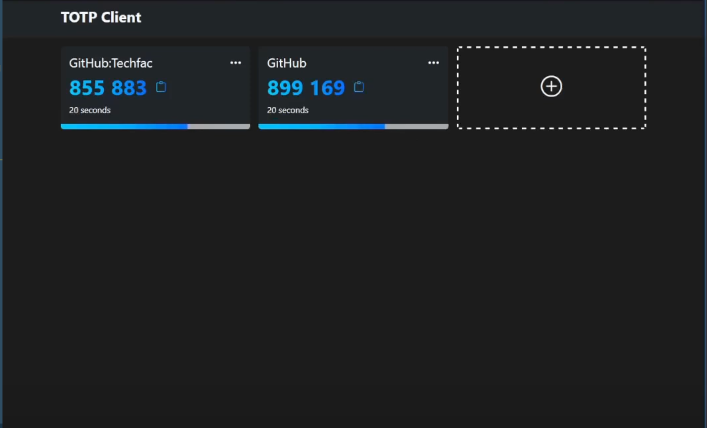

# TOTP Client

A basic TOTP client build with angular.\
You can add a token, remove a token or rename it.\
You can add a token by scanning a QR code or by manually inserting it

## built with

- Angular
- Typescript
- jssha for hash

## Functionality

The tokens are stored (unencrypted) in the localstorage of the browser. (just a concept, ok...)

### startscreen

Add a new token by clicking on the plus icon.

### Add token by camera

### Add token by form

### View tokens

## Video

https://www.youtube.com/watch?v=mYn_DObDgNE

